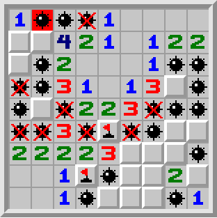

# Minesweeper

## Rules 
* The number of mines in a board and the size of the board is predetermined by the player. The default board size is 9 * 9, and the number of mines in the board is 10. 
* A "square" indicates any of the units in the game of minesweeper that contain either a number, a blank("0"), or a mine.
* The first square clicked never contains a mine.
* Left-clicking the square and chordinhg.
* If a square is successfully opened without containing a mine, it shows a number. The number indicates the number of mines that exist in the eight squares touching the square the number was in.
* Right-clicking the square, a flag appears over the square. Right-clicking again to remove the flag. 
* The game of minesweeper is won at the point when all squares that are not mines are clicked open.
* The game of minesweeper is lost there is any inaccuracy in the flagging around the number



## Built With 
Recreating the old Microsoft Minesweeper with HTML, CSS, JavaScript and jQuery.

## Installing 
```bash
Download the files and open minesweeper.html in a browser.
```
## To-do list
* Improve the user experience of clicking squares (timeout for mouseup, change
  CSS for clicked squares, etc.)
* Add mine countdown and timer from original game
* Experiment with Bootstrap?
* Add server-side component for high scores, use Node.js?
* Obscure square status from the HTML

## License
This project is licensed under the terms of the GNU General Public License.
